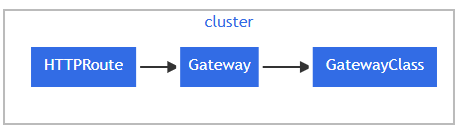

# What's gateway API
#TODO - Define what's gateway api

nstead of Gateway API resources being natively implemented by Kubernetes, the specifications are defined as Custom Resources supported by a wide range of implementations. Install the Gateway API CRDs or follow the installation instructions of your selected implementation.
https://kubernetes.io/docs/concepts/services-networking/gateway/

Gateway API is a family of API kinds that provide dynamic infrastructure provisioning and advanced traffic routing.
Make network services available by using an extensible, role-oriented, protocol-aware configuration mechanism. Gateway API is an add-on containing API kinds that provide dynamic infrastructure provisioning and advanced traffic routing.

Resource model
Gateway API has four stable API kinds:

GatewayClass: Defines a set of gateways with common configuration and managed by a controller that implements the class.

Gateway: Defines an instance of traffic handling infrastructure, such as cloud load balancer.

HTTPRoute: Defines HTTP-specific rules for mapping traffic from a Gateway listener to a representation of backend network endpoints. These endpoints are often represented as a Service.

GRPCRoute: Defines gRPC-specific rules for mapping traffic from a Gateway listener to a representation of backend network endpoints. These endpoints are often represented as a Service.

Gateway API is organized into different API kinds that have interdependent relationships to support the role-oriented nature of organizations. A Gateway object is associated with exactly one GatewayClass; the GatewayClass describes the gateway controller responsible for managing Gateways of this class. One or more route kinds such as HTTPRoute, are then associated to Gateways. A Gateway can filter the routes that may be attached to its listeners, forming a bidirectional trust model with routes.

migration from ingress
https://gateway-api.sigs.k8s.io/guides/migrating-from-ingress/#migrating-from-ingress

Reasons to Switch to Gateway API¶
The Ingress API is the standard Kubernetes way to configure external HTTP/HTTPS load balancing for Services. It is widely adopted by Kubernetes users and well-supported by vendors with many implementations (Ingress controllers) available. Additionally, several cloud-native projects integrate with the Ingress API, such as cert-manager and ExternalDNS.

However, the Ingress API has several limitations:

Limited features. The Ingress API only supports TLS termination and simple content-based request routing of HTTP traffic.
Reliance on annotations for extensibility. The annotations approach to extensibility leads to limited portability as every implementation has its own supported extensions that may not translate to any other implementation.
Insufficient permission model. The Ingress API is not well-suited for multi-team clusters with shared load-balancing infrastructure.
Gateway API addresses those limitations, as the next section will show.

# References

https://kubernetes.io/docs/concepts/services-networking/gateway/

https://gateway-api.sigs.k8s.io/guides/migrating-from-ingress/#migrating-from-ingress

Is there any compatible with my K3s ?
https://gateway-api.sigs.k8s.io/guides/migrating-from-ingress/#migrating-from-ingress

# How to

Install the CRDs
kubectl apply -f no arquivo crd

install the [contour gateway controller](https://projectcontour.io/)
kubectl apply -f no contour.yaml